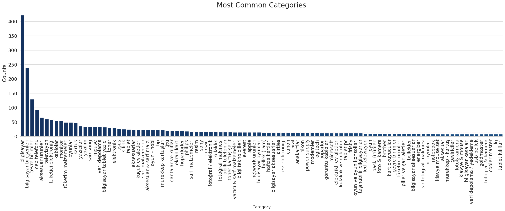
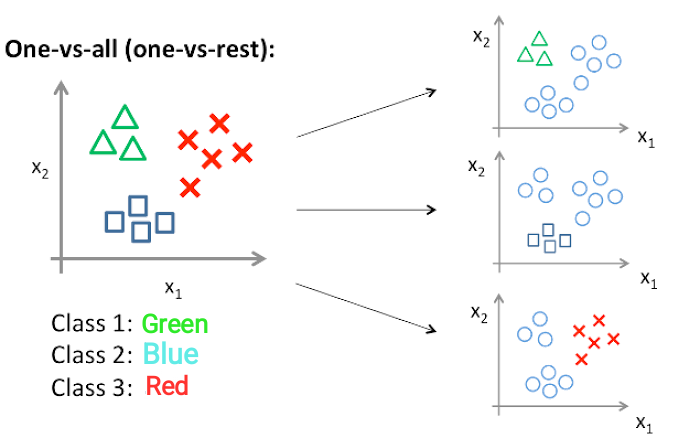
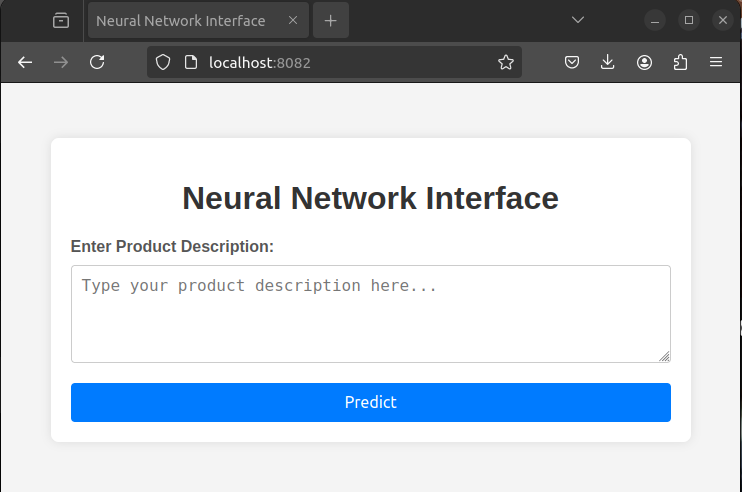

# Product Category Prediction

This project aims to predict product categories based on their Turkish descriptions. It utilizes various Python libraries and machine learning techniques to process and analyze product description data, ultimately classifying them into predefined categories.

## Project Structure

The project is structured into Jupyter Notebooks, each serving a specific purpose in the data processing and model training pipeline.

### Notebooks

- **PRODUCT_CATEGORY_PREDICTION.ipynb**: The main notebook that includes all the steps from data loading, preprocessing, model training, and evaluation.

### Data

The data used in this project consists of product descriptions and their corresponding categories. It is divided into two main files:

- **Product_Explanation.txt**: Contains product IDs and their descriptions.
- **Product_Categories.txt**: Contains product IDs and their corresponding categories.

Also third one is created later with our notebooks:
- **cleaned_data.csv**: Contains product IDs with their cleared description and their corresponding categories.   

## My Approach

### Data Analyzing

Since one product may have multi categories. I want to analyze the number of this categories first.

#### Categories

- **Similar Categories**: I realize that there are lost of categories that their names are similar, such as "bilgisayar" & "bilgisayarlar". So I decided to regroup them. 
* "bilgisayar bileşenleri" + "bilgisayar ürünleri" + "oem ürünleri" + "oem & çevre birimleri" + "bilgisayar bileşenleri (oem)"
* "çevre birimleri" + "bilgisayar parçaları" + "çevre birimi"
* "televizyon" + "televizyonlar" + "led TV" + "tv & görüntü sistemleri"
* "pc" + "bilgisayar" + "Kişisel Bilgisayarlar"
* "yazılım ürünleri" + "Yazılım ve Hizmetler" + "Yazılım"
* "Hobi & Oyun Konsolları" + "Oyun & Oyun Konsolu" + "oyun - hobi"
* "hafıza kartları" + "hafıza kartı"

- **Graph**:



As we can see in the graph, our dataset is pretty unbiased. The "bilgisayar" and "bilgisayar bileşenleri" dominate hole dataset.
I don't want to decrease the number of these categories since our dataset is pretty small and I don't want to make it even smaller.

#### Explanations

- **Null Values**: Since our values are text, I couldn't fill these empty slots, so removing them might me a solution.

##### Preprocessing: 
To clean the data, we need to apply some techniques. Tokenization, vectorization are used. Also I created a library `preprocess_tr.py`, to clear the data properly. Common libraries like `nltk` do not perform good results for Turkish content, therefore I decided use different libraries and mix them. 

- **Vector**: Using a `tf-idf` weighting scheme rather than normal boolean weights for better performance. Since the tf–idf is the product of two statistics, term frequency and inverse document frequency. It gives an idea for each word.

- **Functions**: To keep only alphanumeric characters and to clean punctuation, `re` is used. Since Turkish is an agglutinative language, to get rid of unnecessary paragoges (**stemming**), `zeyrek` is one the best libraries for Turkish stemming process. To remove stop words (used each time, such as "sen" "ben") I use a stop word list for Turkish from https://github.com/sgsinclair/trombone/blob/master/src/main/resources/org/voyanttools/trombone/keywords/stop.tr.turkish-lucene.txt

### Model Building

Since I do not have any experience about text to text classification. I try to implement some of concepts through my researches.

#### One vs All



Actually I got very high accuracy like **0.97**, but it's real performance is disappointed. Even if model always predict 0 each time, we actually predict True negative with high accuracy then we have 1800-(num of product that this category) / 1800 gives high rates. 
For example num of product that this category is 200. While our model predict 0 each time, we got **1800-200/1800 = 0.88** accruacy.

#### Multiclassification with CNN Models

##### Multi-label multiclassification

In V2 I have tried to implement multi-label multiclassification, to predict all categories of a product.

##### Mutliclassification with Only Specific Classes

In V2.1 I have tried to implement multiclassification with only specific classes, to predict just specific category of a product.

##### Mutliclassification with Only General Classes

In V2.2 I have tried to implement multiclassification with only general classes, to predict just general category of a product.

#### Vector Based FAISS

In this method, I do **not build any model**. Instead I just tried to implement very efficient vector search algorithm.

The reason behind using FAISS is that most e-commerce componies use it in their products, such as **Trendyol**


### Installation

To run this project, you need to have Python installed on your system. After cloning the repository, install the required libraries using the following command:

```bash
pip install -r requirements.txt
```

```markdown
## Prerequisites

- Docker installed on your machine

## Build the Docker Image

Run the following command in your terminal to build the Docker image. Replace `product-category-prediction` with your desired image name:

```bash
docker build -t product-category-prediction .
```

## Run the Docker Container

After the image has been built, you can run the container using:

```bash
docker run -p 8082:5002 product-category-prediction
```

This command runs the Docker container and maps port `8082` of the container to port `5002` on your host, allowing you to access the Jupyter notebook server by navigating to [http://localhost:8082](http://localhost:8082) in your web browser.

**Note:** The first time you run the `docker build` command, it might **take a while** as it needs to download the base image and install the required packages. Subsequent builds will be faster due to Docker's caching mechanism. (*Please wait it will work*)

### Interface



One can type any explanation of a product and press "Predict" button. Then see the results with proababilities.

The App uses the V2 model. You can change the model from `app.py`

## Accessing the Jupyter Notebook

You can reach each notebook on subfolders with version name. You can analyze the results.

## Conclusion

My models are not gives high accuracy rate, first it gives **0.01**. Then I realize that stemming process ruin the holl data, so I decided to not use it for preprocessing. You can find the cleaned data in `cleaned_data.csv` file.

After removing stemming, I got **0.5** which is not good enough. But it predict the true categories for my tests manually.

